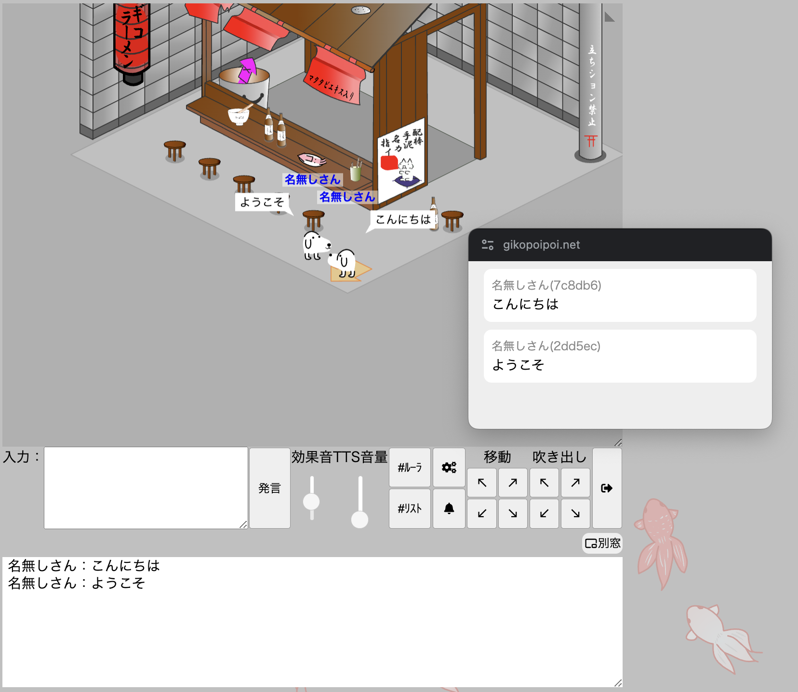

# はじめに

https://gikopoipoi.net/ 向けの UserScript です。

この UserScript をインストールしてから「別窓」ボタンを押すことで、チャットのログ欄を他のウィンドウで表示できます。

# インストール

Google Chrome にこの UserScript をインストールする方法を以下に示します。

## 1. Tampermonkey のインストール

[Tampermonkey](https://chromewebstore.google.com/detail/tampermonkey/dhdgffkkebhmkfjojejmpbldmpobfkfo?hl=ja) をインストールして下さい。

## 2. UserScript のインストール

[UserScript](https://github.com/iwasa-kosui/userscript-gikopoipoi-chatlog/raw/main/dist/userscript-gikopoipoi-chatlog.user.js) をインストールして下さい。
